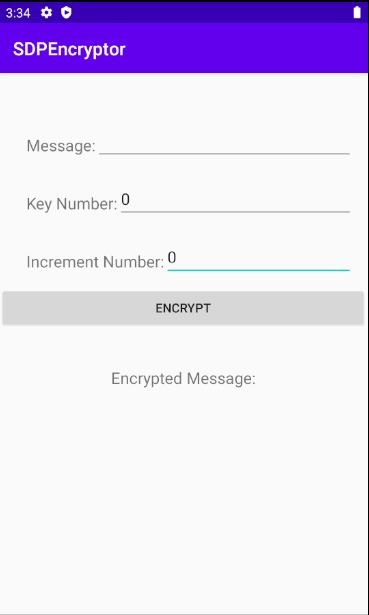
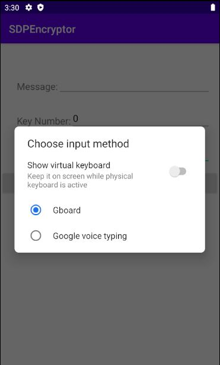
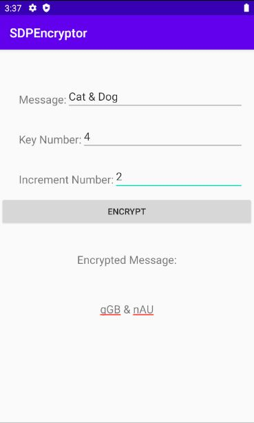
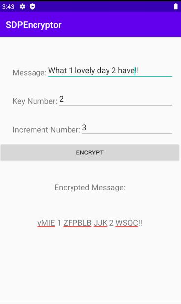
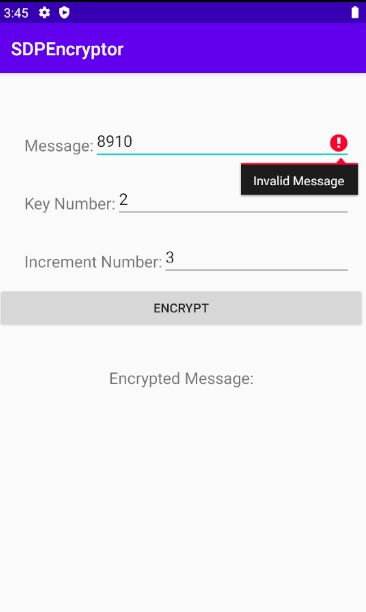
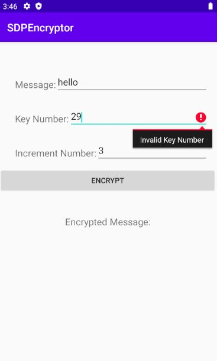
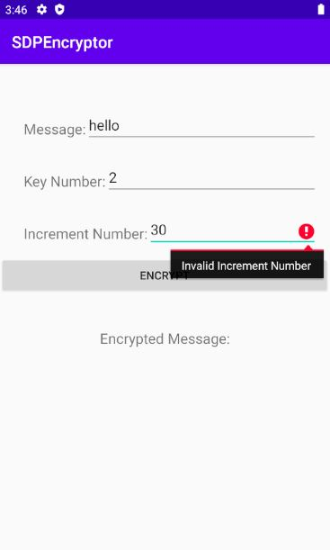

# **User Manual for SDPEncryptor**

Author: dchen357  
Date: 6/5/2020  
​Version: 1.0  

## 1 Introduction

### 1.1 Purpose

SDPEncryptor is a simple Android app designed to implement message encryption using a simple substitution cipher. 

### 1.2 Limitation

SDPEncryptor only encrypts on alphabetic letters while all other characters will stay the same, which means it's unable to cipher any number (0-9) or special characters such as punctuation marks (!?&*...) in the input.  

### 1.3 Requirement

SDPEncryptor runs on Android Operating System.

## 2 How to use SDPEncryptor

### 2.1 Launching the app 

Import the project SDPEncryptor to Android Studio 3.6.3 or later version. Launch and run the app using the emulator (recommended: Pixel 2 API R or similar) or a connected Android device. 

### 2.2 Using the app

#### 2.2.1 Initialization  
Once the app launches, the app interface is presented like below on your screen. The input fields are initialized with some fixed values. `Message` was set to an empty string, `Key Number` and `Increment Number` were both set to 0. You can directly start input your message on the 1st text field but you need to delete the zeros in the 2nd and 3rd text field before you input a valid number in order to make the app work.

 

Remember to slide off the virtual keyboard at the bottom on the right corner, otherwise you may not see the encrypted message.

#### 2.2.2 Detailed steps
 
a. Enter a `Message`  
Enter a valid message (a word, a sentence, etc.) to be encrypted in the top text field. 

b. Enter a `Key Number`  
Enter a valid key number (valid numbers are between 1 and 25 inclusive) to be used in the encryption in the 2nd text field.

c. Enter a `Increment Number`  
Enter a valid increment number (valid numbers are between 1 and 25 inclusive) to be used in the encryption in the 3rd text field.

d. Click the `ENCRYPT` button  
Once you click the gray ENCRYPT button the app would check your input and do the encryption on alphabetic letters if all the three inputs are valid. And the encrypted message will show below `Encrypted Message`. One successful encryption happens like the picture below. Notice that only alphabetic letters got encrypted, other letters stay the same. 

 

### 2.3. Error handling  
If any input is invalid, you would get an error message. For example, if you leave the `Message` field blank or enter a letter-less string (for example, only one alphabetic letter in the input or all the letters are numerical), you would get a red error mark “!” on the right hand of the text field and if you hover over the red mark you will see a floating error message 'Invalid Message' as the picture shows below. And if you entered a non-valid number in with `Key Number` or `Increment Number`, similarly, the error message 'Invalid Key Number' or 'Invalid Increment Number' would pop up if the filed has focus. You may have multiple errors pop out at the same time, just hover over to check the error message. If any of these cases happens, please delete your current input and enter a new valid text or number to make the app work. 

  

 
 
